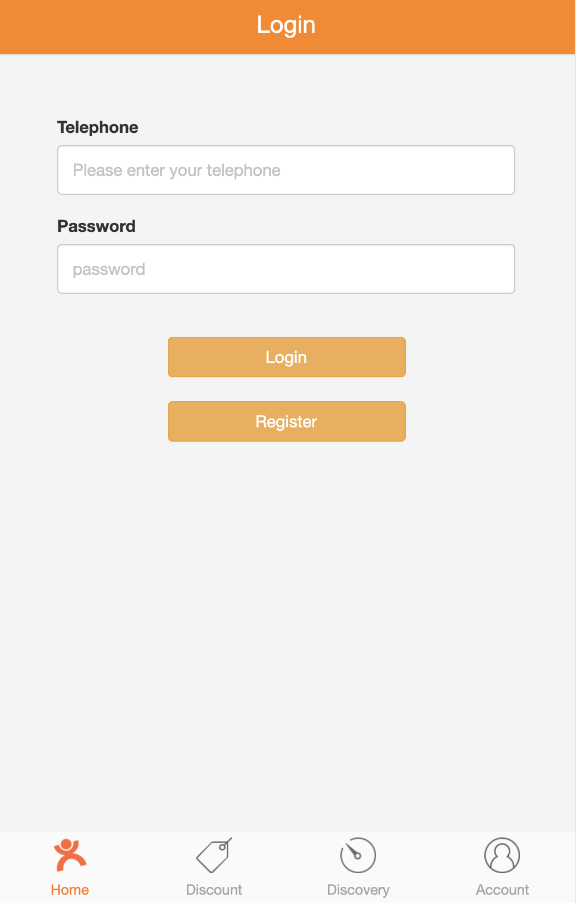

# Store_Search_Recommendation_System
This is a Java SpringBoot project with ElasticSearch and Spark.

#### Recommentdation & Search service
Provide users with Location based conditional search and personalized recommendation functions.

Method	| Path  | Parameter	| Description	| User authenticated	| Available from UI
------------- | ------------ | ------------- | ------------- |:-------------:|:----------------:|
GET	| /shop/recommend | latitude, longitude	| Get personalized shop recommendation	| × | ✓	
GET	| /shop/search	| latitude, longitude, keyword, categoryId, orderby, tags | Get shop search results 	| ×  | ✓

#### Administration service
Manage businesses, stores, and store categories across the platform as an administrator. 

Method	| Path	| Description	| Admin authenticated	| Available from UI
------------- | ------------------------- | ------------- |:-------------:|:----------------:|
GET	| /admin/admin/index	| Get businesses, stores, store categories statistics	          | ✓ | ✓	
POST	| /admin/admin/login	| Admin login	| ×  |  ✓
POST	| /admin/admin/logout	| Admin logout	| ✓  | ✓ 

Provide multiple operations to shop categories.

Method	| Path	| Description	| Admin authenticated	| Available from UI
------------- | ------------------------- | ------------- |:-------------:|:----------------:|
GET	| /admin/category/index	| Get store category statistics	          | ✓ | 	✓
GET	| /admin/category/createpage	| Direct to create page	| ✓  | ✓ 
POST	| /admin/category/create	| Create a new shop category	|  ✓ |  ✓

Provide multiple operations to merchants.

Method	| Path	| Description	| Admin authenticated	| Available from UI
------------- | ------------------------- | ------------- |:-------------:|:----------------:|
GET	| /admin/seller/index	| Get seller statistics	          | ✓ | 	✓
GET	| /admin/seller/createpage	| Direct to create page	| ✓  | ✓ 
POST	| /admin/seller/create	| Create a new seller	|  ✓ |  ✓
POST	| /admin/seller/disable	| Disable a certain seller	|  ✓ |  ✓
POST	| /admin/seller/enable	| Enable  a certain seller	|  ✓ |  ✓

Provide multiple operations to stores.

Method	| Path	| Description	| Admin authenticated	| Available from UI
------------- | ------------------------- | ------------- |:-------------:|:----------------:|
GET	| /admin/shop/index	| Get store statistics	          | ✓ | 	✓
GET	| /admin/shop/createpage	| Direct to create page	| ✓  | ✓ 
POST	| /admin/shop/create	| Create a new store	|  ✓ |  ✓

#### Account service
Contains general user input logic and validation for individual merchants, who can register multiple different types of stores on the management platform.

Method	| Path	| Description	| User authenticated	| Available from UI
------------- | ------------------------- | ------------- |:-------------:|:----------------:|
GET	| /user/get?{id}	| Get specified account data	| × | ×	
GET	| /user/getcurrentuser	| Get current account data	| ✓  | ×
POST	| /user/login	| User login	| ×  | 	×
POST	| /user/logout	| User logout	|  ✓ | ×
POST	| /user/register	| Register new account	| ✓  | ×

# Preview

 
